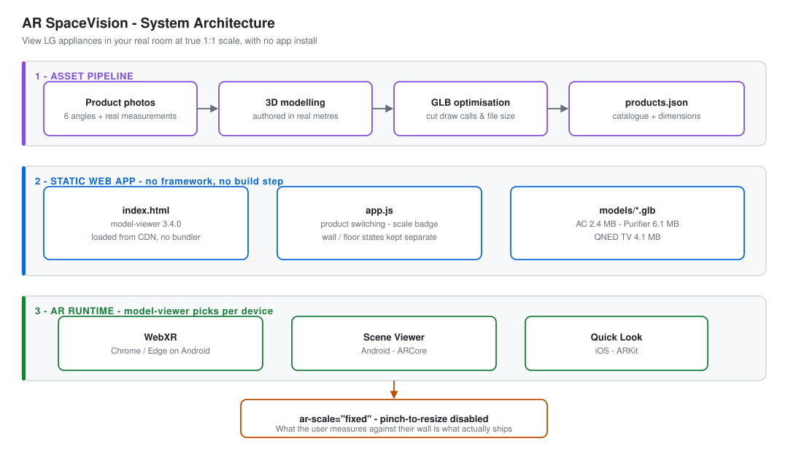
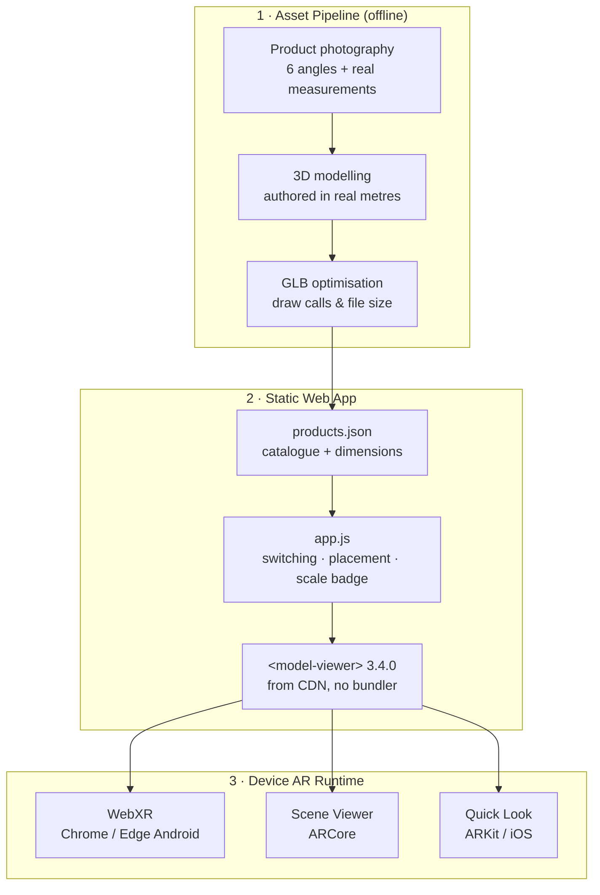
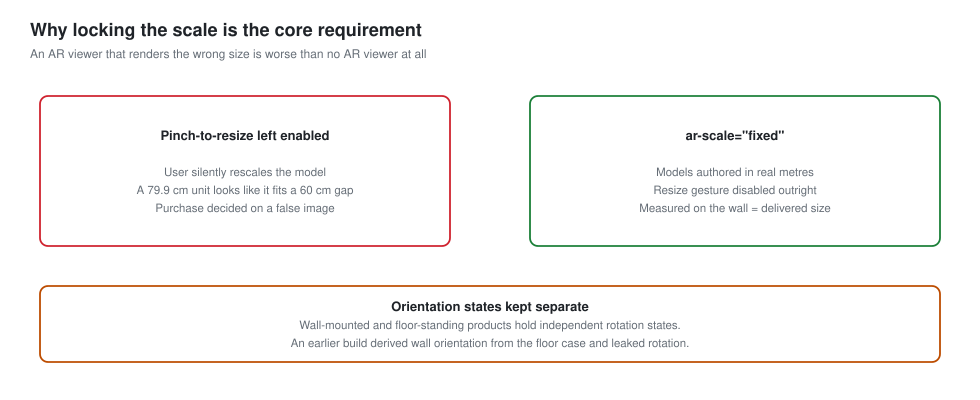

# 🪟 AR SpaceVision (LG Appliance WebAR Viewer)

[](https://github.com/ngtndat/dmx_price_tracker/actions/workflows/deploy-ar.yml)

> **Try an LG appliance in your own room before buying it.** A dependency-free static web app that places 3D product models into the user's physical space at **true 1:1 metric scale** — no app install, no store download, just a URL. Built on `<model-viewer>`, dispatching to **WebXR**, **Scene Viewer** (Android/ARCore) or **Quick Look** (iOS/ARKit) depending on the device.

**🔗 Live demo → https://ngtndat.github.io/dmx_price_tracker/**

> 📦 Companion project: [**LG Retail Price Tracker**](../README.md) — the pricing pipeline that tracks these same products across 8 Vietnamese retailers.

---

## 📐 System Architecture



> 🎨 *Three stages: asset pipeline → static web app → device AR runtime. Nothing between the CDN and the user's camera.*

### 🔄 Rendering Flow



### 🧱 Architectural Components

| Layer | Technology | Notes |
|---|---|---|
| Viewer | `<model-viewer>` 3.4.0 | Loaded from Google CDN — no npm, no build step |
| Catalogue | `products.json` | Single source of truth for models and real dimensions |
| Assets | `.glb` (glTF binary) | 2.4–6.1 MB per product, optimised for mobile data |
| AR session | WebXR / Scene Viewer / Quick Look | Chosen automatically by `model-viewer` per device |
| Dev server | `server.py` (stdlib only) | Registers GLB/USDZ MIME types Python omits |
| Hosting | GitHub Pages via `peaceiris/actions-gh-pages` | Auto-deploys on push to `main` |

---

## 🎯 The Problem

Large appliances are the hardest category to buy online. A product photo tells you nothing about whether a 79.9 cm air conditioner clears the window frame, or whether a floor-standing purifier crowds the walkway. Customers resolve that uncertainty by driving to a showroom — or by not buying at all.

AR solves it in principle, but only under one condition: **the rendering must be dimensionally honest**. An AR viewer that displays the wrong size is worse than no viewer, because it converts uncertainty into false confidence. The customer measures against a lie and orders anyway.

That constraint drove every technical decision in this project.

---

## 📏 Dimensional Honesty



`<model-viewer>` allows pinch-to-resize in AR by default. For a furniture mood-board that is a feature; for appliance fitment it is a correctness bug — a user who accidentally scales a model down by 20% sees a unit that fits a gap it cannot physically fit.

```html
<model-viewer
  ar
  ar-scale="fixed"
  ar-modes="webxr scene-viewer quick-look"
  ...>
```

Two decisions enforce this:

1. **Models are authored in real metres**, not scaled to look right. `products.json` carries the physical dimensions alongside each asset, and the UI renders them as a visible badge so the number is checkable against a tape measure.
2. **`ar-scale="fixed"` disables the resize gesture outright.** What the user measures against their wall is what the delivery truck brings.

---

## 🧭 Placement States

Wall-mounted and floor-standing products need different default orientations — an air conditioner hangs flat against a vertical surface, a purifier stands on the floor.

These are held as **two independent rotation states**, not one derived from the other. An earlier build computed the wall orientation from the floor case; switching between products leaked rotation across the transition, so a floor-standing unit could appear tilted after viewing the air conditioner. Separating the states fixed it at the source rather than by resetting on every switch.

`products.json` declares the mode per product:

```json
{
  "id": "air-conditioner-lg",
  "name": "Máy lạnh Inverter Treo tường LG IDC12M2",
  "placement": "wall",
  "glbFile": "models/ac_lg.glb",
  "glbSizeMB": 2.4,
  "dimensions": { "height": 30.7, "width": 79.9, "depth": 23.5, "unit": "cm" }
}
```

---

## 📦 Catalogue

| Product | Category | Placement | Asset | Size | Status |
|---|---|---|---|---|---|
| Máy lạnh Inverter LG IDC12M2 | Air conditioner | wall | `models/ac_lg.glb` | 2.4 MB | ✅ ready |
| Máy lọc không khí LG PuriCare MD19GQGE0 | Air purifier | floor | `models/purifier_lg.glb` | 6.1 MB | ✅ ready |
| TV LG 65" QNED | Television | floor | `models/tv_65qned_lg.glb` | 4.1 MB | ✅ ready |
| Tủ lạnh LG | Refrigerator | floor | — | — | 🕓 coming soon |
| Tháp giặt sấy LG | Washer tower | floor | — | — | 🕓 coming soon |

Asset budget matters here: these are loaded over mobile data, often outside WiFi, by someone standing in a showroom or living room. The QNED TV model was reduced to **4.1 MB and 16 draw calls** before it was considered shippable.

---

## 📁 Directory Structure

```
AR application/
├── index.html                  # model-viewer host page
├── app.js                      # product switching, placement, scale badge
├── style.css
├── products.json               # catalogue + real-world dimensions
├── server.py                   # local dev server with WebXR MIME types
│
├── models/                     # optimised GLB assets
│   ├── ac_lg.glb
│   ├── purifier_lg.glb
│   └── tv_65qned_lg.glb
│
├── images/products/            # 2D fallbacks and thumbnails
├── product info/               # source photography + reference dimensions
└── docs/                       # architecture diagrams
```

---

## 🚀 Running Locally

```bash
python "AR application/server.py"
# → http://127.0.0.1:8080
```

The stdlib `SimpleHTTPRequestHandler` does not know the MIME types WebXR needs, and a GLB served as `application/octet-stream` silently fails to load. [`server.py`](server.py) registers them explicitly and adds permissive CORS headers for blob loading:

```python
mimetypes.add_type('model/gltf-binary',  '.glb')
mimetypes.add_type('model/vnd.usdz+zip', '.usdz')
mimetypes.add_type('image/avif',         '.avif')
```

> ⚠️ **AR mode requires HTTPS on a real device.** `localhost` works for desktop preview, but to test an actual AR session on a phone you need the deployed GitHub Pages URL or a tunnel. Desktop browsers fall back to an orbit-control 3D viewer.

### Deployment

Every push to `main` publishes this folder to the `gh-pages` branch automatically via [`deploy-ar.yml`](../.github/workflows/deploy-ar.yml). No manual step.

---

## 🧠 Design Notes

**No framework, no build step.** The entire app is three files and a CDN script tag. For a catalogue of five products with no shared state and no routing, a React toolchain would add a build pipeline, a dependency tree, and a deployment step in exchange for nothing. The cost of that choice is manual DOM handling in `app.js`; the benefit is that the app is deployable by copying a folder and debuggable by viewing source.

**Correctness over flexibility.** Locking the AR scale removes a feature users might expect and is the single most important decision in the project. Appliance fitment is a measurement task, not a decoration task, and a measurement tool that can be silently miscalibrated is not a tool.

**Assets are the bottleneck, not code.** Almost all engineering effort went into geometry optimisation rather than application logic. A 40 MB model that renders perfectly is useless to someone on 4G in a store aisle.

---

## 📉 Limitations & Further Work

- **Manual asset pipeline.** Each product requires hand modelling and hand optimisation — roughly a day per SKU. This does not scale to a full catalogue; photogrammetry or vendor-supplied CAD conversion would.
- **No occlusion.** Models render in front of real-world objects rather than behind them. Depth-aware occlusion exists in ARCore but is not exposed uniformly through `model-viewer`.
- **Two products unfinished.** The refrigerator and washer tower are catalogued but have no GLB yet, and the UI shows them as placeholders.
- **No measurement overlay.** The scale badge reports dimensions numerically; an in-AR ruler or clearance guide would let users verify fitment directly against the wall.
- **Not connected to live pricing.** The AR catalogue and the [price tracker](../README.md) cover the same products but share no data. Surfacing the current best retail price inside the AR view is the obvious integration.

---

<details>
<summary><b>🇻🇳 Bản tiếng Việt — bấm để mở</b></summary>

<br>

## 🎯 Bài toán

Đồ gia dụng cỡ lớn là ngành hàng khó mua online nhất. Một tấm ảnh sản phẩm không cho biết chiếc máy lạnh 79,9 cm có lọt khung cửa sổ hay không, hay chiếc máy lọc không khí đặt sàn có chắn lối đi hay không. Khách hàng giải quyết sự bất định đó bằng cách chạy tới showroom — hoặc bằng cách không mua nữa.

AR về nguyên tắc giải được bài toán này, nhưng chỉ với một điều kiện: **hình ảnh phải trung thực về kích thước**. Một ứng dụng AR hiển thị sai kích thước còn tệ hơn là không có AR, vì nó biến sự bất định thành sự tự tin sai lầm. Khách đo theo một hình ảnh dối, rồi vẫn đặt hàng.

Ràng buộc đó chi phối mọi quyết định kỹ thuật trong dự án.

## 📏 Trung thực về kích thước

Mặc định, `<model-viewer>` cho phép pinch phóng to thu nhỏ trong AR. Với một ứng dụng bày trí nội thất thì đó là tính năng; với bài toán lắp vừa thiết bị thì đó là lỗi đúng-sai — người dùng vô tình thu nhỏ model 20% sẽ thấy một chiếc máy vừa khít cái hốc mà thực tế nó không thể lọt.

Hai quyết định để bảo đảm điều này:

1. **Model được dựng theo đơn vị mét thật**, không phải chỉnh cho "nhìn vừa mắt". `products.json` lưu số đo vật lý kèm mỗi asset, và giao diện hiển thị thành badge để người dùng đối chiếu được với thước dây.
2. **`ar-scale="fixed"` vô hiệu hoá hẳn thao tác phóng to.** Cái người dùng đo trên tường chính là cái xe giao hàng mang tới.

## 🧭 Trạng thái hướng đặt

Sản phẩm treo tường và sản phẩm đặt sàn cần hướng mặc định khác nhau — máy lạnh áp phẳng vào mặt tường dọc, máy lọc không khí đứng trên sàn.

Hai hướng này được giữ thành **hai trạng thái xoay độc lập**, không suy cái này ra từ cái kia. Một bản trước tính hướng treo tường dựa trên trạng thái đặt sàn; khi chuyển qua lại giữa các sản phẩm thì góc xoay bị rò qua, khiến sản phẩm đặt sàn hiện nghiêng sau khi vừa xem máy lạnh. Tách riêng trạng thái xử lý được tận gốc, thay vì phải reset mỗi lần đổi sản phẩm.

## 📦 Danh mục

| Sản phẩm | Ngành hàng | Kiểu đặt | Asset | Dung lượng | Trạng thái |
|---|---|---|---|---|---|
| Máy lạnh Inverter LG IDC12M2 | Máy lạnh | tường | `models/ac_lg.glb` | 2,4 MB | ✅ sẵn sàng |
| Máy lọc không khí LG PuriCare MD19GQGE0 | Máy lọc KK | sàn | `models/purifier_lg.glb` | 6,1 MB | ✅ sẵn sàng |
| TV LG 65" QNED | TV | sàn | `models/tv_65qned_lg.glb` | 4,1 MB | ✅ sẵn sàng |
| Tủ lạnh LG | Tủ lạnh | sàn | — | — | 🕓 sắp có |
| Tháp giặt sấy LG | Giặt sấy | sàn | — | — | 🕓 sắp có |

Ngân sách dung lượng rất quan trọng: các file này được tải qua mạng di động, thường là ngoài WiFi, bởi người đang đứng trong showroom hoặc phòng khách. Model TV QNED được tối ưu xuống còn **4,1 MB và 16 draw call** trước khi được coi là dùng được.

## 🚀 Chạy tại máy

```bash
python "AR application/server.py"
# → http://127.0.0.1:8080
```

`SimpleHTTPRequestHandler` của thư viện chuẩn không biết các MIME type mà WebXR cần, và file GLB phục vụ dưới dạng `application/octet-stream` sẽ im lặng không nạp được. [`server.py`](server.py) đăng ký thủ công các MIME type này và thêm header CORS để nạp blob.

> ⚠️ **Chế độ AR cần HTTPS trên thiết bị thật.** `localhost` đủ để xem thử trên desktop, nhưng muốn test một phiên AR thật trên điện thoại thì phải dùng URL GitHub Pages đã deploy hoặc một tunnel. Trình duyệt desktop sẽ lùi về chế độ xem 3D xoay bằng chuột.

Mỗi lần push lên `main`, thư mục này tự động được publish sang nhánh `gh-pages`.

## 🧠 Ghi chú thiết kế

**Không framework, không bước build.** Toàn bộ ứng dụng là ba file cộng một thẻ script CDN. Với một danh mục 5 sản phẩm, không có state dùng chung và không có routing, một toolchain React sẽ thêm vào pipeline build, cây dependency và một bước deploy mà chẳng đổi lại được gì. Cái giá phải trả là phải thao tác DOM thủ công trong `app.js`; cái được là ứng dụng deploy bằng cách copy thư mục và debug bằng cách xem source.

**Đúng quan trọng hơn linh hoạt.** Khoá tỉ lệ AR đồng nghĩa với việc bỏ đi một tính năng mà người dùng có thể mong đợi, và đó là quyết định quan trọng nhất của dự án. Xem thiết bị có lắp vừa hay không là một bài toán đo đạc, không phải bài toán trang trí, và một công cụ đo có thể bị chỉnh sai một cách âm thầm thì không còn là công cụ.

**Nút thắt nằm ở asset, không nằm ở code.** Gần như toàn bộ công sức kỹ thuật đổ vào tối ưu hình học chứ không phải logic ứng dụng. Một model 40 MB render hoàn hảo thì vô dụng với người đang dùng 4G giữa lối đi trong siêu thị điện máy.

## 📉 Hạn chế & hướng phát triển

- **Quy trình dựng asset còn thủ công.** Mỗi sản phẩm cần dựng và tối ưu bằng tay, khoảng một ngày cho mỗi SKU. Cách này không mở rộng ra được cả danh mục; photogrammetry hoặc chuyển đổi từ file CAD của nhà sản xuất mới giải quyết được.
- **Chưa có occlusion.** Model luôn hiện đè lên vật thể thật thay vì bị che khuất phía sau. ARCore có hỗ trợ occlusion theo chiều sâu nhưng chưa được `model-viewer` expose đồng nhất.
- **Hai sản phẩm chưa hoàn thiện.** Tủ lạnh và tháp giặt sấy đã có trong danh mục nhưng chưa có file GLB, giao diện đang hiển thị dạng placeholder.
- **Chưa có lớp đo đạc trong AR.** Badge kích thước mới chỉ hiện số; một thước đo hoặc đường dẫn khoảng hở ngay trong AR sẽ giúp người dùng tự kiểm chứng trực tiếp trên tường.
- **Chưa nối với dữ liệu giá.** Danh mục AR và [pipeline theo dõi giá](../README.md) cùng nói về một nhóm sản phẩm nhưng không chia sẻ dữ liệu. Hiển thị giá bán lẻ tốt nhất hiện tại ngay trong khung AR là hướng tích hợp rõ ràng nhất.

</details>

---

## 🤝 Related

| Project | Description |
|---|---|
| [**LG Retail Price Tracker**](../README.md) | Automated price intelligence across 8 Vietnamese retailers |
