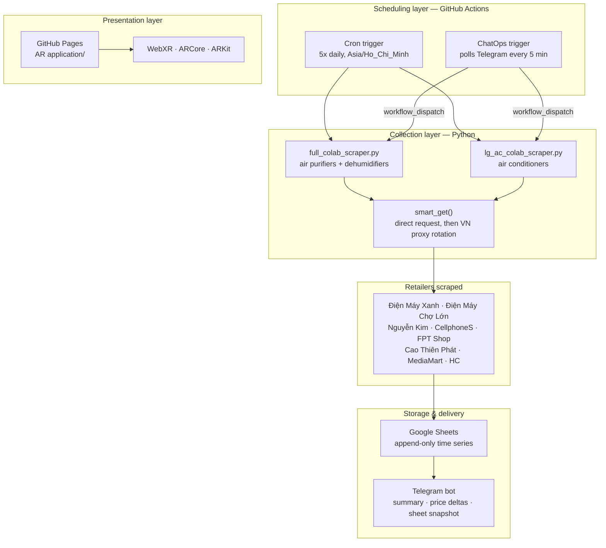

# LG Retail Price Tracker & AR Product Viewer

A self-hosted competitive-pricing pipeline for LG home appliances on the Vietnamese
e-commerce market, plus a companion WebAR application that places the same products
in the user's room at true 1:1 scale.

Everything runs on free infrastructure: GitHub Actions for scheduling, Google Sheets
as the data warehouse, Telegram as the alerting and command channel, and GitHub Pages
for the AR front-end. There is no server to maintain and no recurring cost.

**Live AR demo →** https://ngtndat.github.io/dmx_price_tracker/

---

## Overview

Retail prices for the same appliance model routinely differ across Vietnamese
electronics chains, and each retailer runs its own promotions on its own cadence.
Tracking that by hand does not scale past a handful of SKUs.

This repository automates the loop end to end:

1. **Collect** — scrape LG product listings from 8 major Vietnamese retailers, five
   times a day.
2. **Store** — append every observation to Google Sheets as an immutable time series.
3. **Detect** — diff each scrape against the previous one to surface genuine price moves.
4. **Notify** — push a summary, the list of price changes, and a rendered image of the
   sheet to Telegram.
5. **Visualise** — let a prospective buyer view the product in their own space through
   the browser, no app install required.



---

## Part 1 — Price collection pipeline

### Coverage

| Scraper | Product category | Retailers | Sheet tab |
|---|---|---|---|
| [`full_colab_scraper.py`](full_colab_scraper.py) | Air purifiers + dehumidifiers | 8 | `Sheet1` |
| [`lg_ac_colab_scraper.py`](lg_ac_colab_scraper.py) | Air conditioners (22 model codes) | 7 | `raw_RAC` |

Most retailers are scraped from their LG category page. Nguyễn Kim is the exception:
its category listing omits prices for several SKUs, so the air-purifier scraper walks
a hard-coded list of 10 product URLs and parses each detail page individually
([`NK_PRODUCT_URLS`](full_colab_scraper.py#L45)).

### Network resilience

Several of these sites rate-limit or geo-fence non-Vietnamese traffic, which matters
because GitHub Actions runners sit outside Vietnam. `smart_get()`
([full_colab_scraper.py:186](full_colab_scraper.py#L186)) handles this with a
three-stage escalation:

1. Try a direct request.
2. If that fails, retry through the last proxy known to work — most scrapes in a run
   hit the same host, so caching the winner avoids re-searching the pool every time.
3. Otherwise rotate through up to 25 Vietnamese HTTP proxies, pooled from two public
   APIs (ProxyScrape and Geonode) and fetched lazily on first use.

Each retailer parser is wrapped in its own `try/except`. One site changing its markup
degrades that source to zero rows; it never aborts the run or loses the other seven.

### Output schema

Each scrape appends one row per product observation. Rows are never updated or deleted,
so the sheet accumulates a full price history rather than a snapshot:

| Column | Meaning |
|---|---|
| `Giờ quét` | Scrape timestamp, GMT+7 (written only on CI runs) |
| `Page Title` | Retailer identifier — `DMX`, `NguyenKim`, `FPT`, … |
| `Mã Model` | Model code normalised out of the product name/URL |
| `Tên Model` | Raw product title as listed |
| `Status` | Availability text from the retailer |
| `direct product link` | Canonical product URL |
| `MRP price` | List price before discount |
| `Selling price` | Actual selling price |
| `Thông tin chương trình khuyến mãi` | Free-text promotion blurb |

### Change detection

Before writing, the scraper reads the existing sheet back and builds a map of
`(retailer, model code) → last selling price`. Any row whose price differs from its
predecessor is collected into `price_changes` and highlighted in the Telegram message
([full_colab_scraper.py:1306](full_colab_scraper.py#L1306)).

Keying on the pair rather than the model alone is deliberate: the same SKU carries
different prices at different chains, and a naive model-only key would report a change
every time the iteration order shifted.

A product seen for the first time produces no alert — there is no baseline to compare
against, and emitting one would flood the channel on the first run after adding a SKU.

### Alerting

After a successful write the bot sends a run summary with per-retailer row counts, the
list of price movements, and the next scheduled run time. It then renders the report tab
to a PNG via matplotlib and posts that image too, so the numbers are readable on a phone
without opening Sheets.

---

## Part 2 — ChatOps trigger

Waiting for the next cron slot is inconvenient when you need a number right now, and the
GitHub Actions UI is awkward on mobile. [`telegram_listener.yml`](.github/workflows/telegram_listener.yml)
closes that gap: every 5 minutes it runs
[`check_telegram_command.py`](.github/scripts/check_telegram_command.py), which polls
`getUpdates` for a message matching `quét` / `quet` / `scan` and fires a
`workflow_dispatch` against the scraper workflow.

Three details make this safe to leave running unattended:

- **Sender allow-list** — messages are accepted only from the configured `TELEGRAM_CHAT_ID`.
  Anyone else who finds the bot is ignored.
- **Freshness window** — commands older than 6 minutes are discarded, so a backlog cannot
  replay as a burst of scrapes.
- **Offset confirmation** — after handling a command the script re-calls `getUpdates` with
  an advanced offset, which is Telegram's acknowledgement mechanism. Without it the same
  message would re-trigger the workflow on every poll.

---

## Part 3 — AR product viewer

[`AR application/`](AR%20application/) is a dependency-free static site that renders LG
appliances in the user's physical space via `<model-viewer>` 3.4.0, which dispatches to
WebXR, Scene Viewer (Android/ARCore) or Quick Look (iOS/ARKit) depending on the device.

| Product | Placement | Asset | Status |
|---|---|---|---|
| Máy lạnh LG IDC12M2 | wall | `ac_lg.glb` (2.4 MB) | ready |
| Máy lọc không khí LG PuriCare MD19GQGE0 | floor | `purifier_lg.glb` (6.1 MB) | ready |
| TV LG 65" QNED | floor | `tv_65qned_lg.glb` (4.1 MB) | ready |
| Tủ lạnh LG | floor | — | coming soon |
| Tháp giặt sấy LG | floor | — | coming soon |

The core requirement was **dimensional honesty**: an AR viewer that renders a 79.9 cm air
conditioner at the wrong size is worse than no viewer, because it produces confident but
false purchasing decisions. Models are authored to real metric dimensions and
`ar-scale="fixed"` disables the pinch-to-resize gesture, so what the user measures on
their wall is what ships.

Wall-mounted and floor-standing products need different default orientations. These are
held as separate states rather than derived from one another — an earlier version
computed wall orientation from the floor case and leaked rotation across product
switches.

A push to `main` redeploys the folder to the `gh-pages` branch automatically
([`deploy-ar.yml`](.github/workflows/deploy-ar.yml)).

---

## Schedule

Both scrapers run five times daily. GitHub Actions cron is UTC-only, so the schedule is
offset by 7 hours from Vietnam time:

| Vietnam (GMT+7) | Cron (UTC) |
|---|---|
| 07:00 | `0 0 * * *` |
| 09:30 | `30 2 * * *` |
| 12:00 | `0 5 * * *` |
| 16:00 | `0 9 * * *` |
| 20:00 | `0 13 * * *` |

The same times are mirrored in `SCHEDULE_TIMES` inside each script. On CI the scripts
detect `GITHUB_ACTIONS=true` and scrape immediately; the in-process scheduler is only
used when running locally or in Google Colab, where it also drives the "next run at …"
line in the Telegram message.

---

## Repository layout

```
├── full_colab_scraper.py          # Air purifier + dehumidifier scraper
├── lg_ac_colab_scraper.py         # Air conditioner scraper
├── .env.example                   # Required environment variables
├── .github/
│   ├── workflows/
│   │   ├── lg_price_scraper.yml   # 5x daily scrape, two parallel jobs
│   │   ├── telegram_listener.yml  # ChatOps poller, every 5 min
│   │   └── deploy-ar.yml          # Publish AR app to GitHub Pages
│   └── scripts/
│       └── check_telegram_command.py
└── AR application/
    ├── index.html                 # model-viewer host page
    ├── app.js                     # Product switching, placement, scale badge
    ├── products.json              # Catalogue + real-world dimensions
    ├── models/                    # GLB assets
    └── server.py                  # Local dev server with WebXR MIME types
```

---

## Configuration

No credentials live in the source tree. Every scraper reads its configuration from the
environment; see [`.env.example`](.env.example).

| Variable | Purpose |
|---|---|
| `GOOGLE_SERVICE_ACCOUNT_JSON` | Service account JSON with edit access to the sheet |
| `SPREADSHEET_URL` | Target spreadsheet (both scrapers share one, on separate tabs) |
| `SHEET_NAME` | `Sheet1` for purifiers, `raw_RAC` for air conditioners |
| `TELEGRAM_BOT_TOKEN` | Bot token from @BotFather |
| `TELEGRAM_CHAT_ID` | Destination chat, also the ChatOps allow-list |

On GitHub these are repository secrets. `SHEET_NAME` is not sensitive and is set inline
per job in the workflow. If `SPREADSHEET_URL` is missing the script exits immediately
with a clear message rather than running and silently discarding its results.

### Running locally

```bash
pip install requests[socks] beautifulsoup4 gspread urllib3 matplotlib
cp .env.example .env          # then fill in the values and export them
python full_colab_scraper.py
```

Run interactively, the script offers a choice between scraping immediately and waiting
on the built-in scheduler. Both scrapers are also single-file by design so they can be
pasted straight into a Google Colab cell — that was the original deployment target,
before the pipeline moved to GitHub Actions.

For the AR app: `python "AR application/server.py"` serves it on `127.0.0.1:8080` with
the GLB/USDZ MIME types that WebXR requires and that Python's default static handler
does not register.

---

## Design notes

**Google Sheets as the warehouse.** A relational database would model this data better.
Sheets won because the end users are category managers who already live in spreadsheets:
they can pivot, chart, and share the data without anyone provisioning access or writing
a query. The append-only pattern keeps the raw observations intact so a real database can
be backfilled later without data loss.

**Two scrapers, not one parameterised module.** The two categories share roughly 60% of
their parsing logic, and the duplication is real. It was kept because each file must stay
runnable as a standalone Colab cell — extracting a shared module would break the paste-and-run
workflow that non-engineer colleagues depend on. This is a deliberate trade of DRY for
distribution, not an oversight.

**Failure is partial, never total.** Per-retailer exception isolation, proxy fallback, and
a guard that refuses to start without configuration all follow the same principle: a run
that collects 7 of 8 sources is useful, and a run that reports honestly on what it missed
is more useful than one that silently writes nothing.

## Limitations & further work

- **Parser fragility.** Every scraper is coupled to the retailer's current HTML. There is
  no schema-change detection beyond the row count dropping to zero, and no test suite
  pinned to recorded fixtures.
- **Silent degradation on auth failure.** If the service account cannot be authenticated,
  the script falls back to a print-only test mode and still exits `0`, so the CI job shows
  green while writing nothing. On CI this should fail loudly instead.
- **Public proxy quality.** The free proxy pools are unreliable and unvetted. A paid
  residential proxy, or a runner hosted inside Vietnam, would remove this dependency.
- **No analytics layer.** The pipeline captures a rich price time series but currently only
  diffs consecutive scrapes. Elasticity estimates, promotion-cycle detection, and
  cross-retailer positioning are the obvious next step.

## Scope & intent

This project scrapes publicly accessible catalogue pages, read-only, five times a day —
a volume far below normal browsing traffic. It collects listed prices and promotion text
only; no personal data, no account-gated content, no checkout interaction. It was built
to support internal pricing analysis of one brand's own products across its retail partners.

---

<details>
<summary><b>🇻🇳 Tiếng Việt — bấm để mở</b></summary>

<br>

## Tổng quan

Dự án tự động hoá việc theo dõi giá bán lẻ các sản phẩm gia dụng LG trên thị trường
thương mại điện tử Việt Nam, kèm một ứng dụng WebAR cho phép xem sản phẩm ngay trong
không gian thật của người dùng theo đúng tỉ lệ 1:1.

Toàn bộ chạy trên hạ tầng miễn phí: GitHub Actions lo lịch chạy, Google Sheets làm kho
dữ liệu, Telegram làm kênh cảnh báo và ra lệnh, GitHub Pages host ứng dụng AR. Không có
máy chủ phải bảo trì, không phát sinh chi phí định kỳ.

**Demo AR →** https://ngtndat.github.io/dmx_price_tracker/

### Bài toán

Cùng một model máy lạnh hay máy lọc không khí, giá tại mỗi chuỗi điện máy lại khác nhau,
và mỗi bên chạy khuyến mãi theo nhịp riêng. Theo dõi thủ công không khả thi khi số lượng
SKU vượt quá vài chục.

Quy trình được tự động hoá khép kín: **thu thập** giá từ 8 nhà bán lẻ, 5 lần mỗi ngày →
**lưu** vào Google Sheets dạng chuỗi thời gian chỉ ghi thêm → **phát hiện** biến động giá
bằng cách so với lần quét trước → **thông báo** qua Telegram kèm ảnh chụp bảng → **trực
quan hoá** sản phẩm qua AR ngay trên trình duyệt, không cần cài app.

## Phần 1 — Pipeline thu thập giá

| Scraper | Ngành hàng | Số site | Tab Sheet |
|---|---|---|---|
| [`full_colab_scraper.py`](full_colab_scraper.py) | Máy lọc không khí + máy hút ẩm | 8 | `Sheet1` |
| [`lg_ac_colab_scraper.py`](lg_ac_colab_scraper.py) | Máy lạnh (22 mã model) | 7 | `raw_RAC` |

Các site: Điện Máy Xanh, Điện Máy Chợ Lớn, Nguyễn Kim, CellphoneS, FPT Shop,
Cao Thiên Phát, MediaMart, HC.

Riêng Nguyễn Kim, trang danh mục không hiện giá cho một số SKU, nên scraper máy lọc không
khí duyệt qua danh sách 10 URL sản phẩm và bóc từng trang chi tiết
([`NK_PRODUCT_URLS`](full_colab_scraper.py#L45)).

**Chống chặn.** Một số site giới hạn hoặc chặn traffic ngoài Việt Nam, trong khi runner
của GitHub Actions lại đặt ở nước ngoài. Hàm `smart_get()`
([full_colab_scraper.py:186](full_colab_scraper.py#L186)) xử lý theo 3 bậc: thử kết nối
trực tiếp → thử lại bằng proxy vừa dùng thành công gần nhất (đa số request trong một lượt
quét trỏ cùng một host, nên cache lại proxy thắng cuộc giúp khỏi dò lại từ đầu) → cuối
cùng mới xoay vòng tối đa 25 proxy HTTP Việt Nam lấy từ ProxyScrape và Geonode.

Mỗi site có `try/except` riêng. Một site đổi giao diện thì chỉ nguồn đó về 0 dòng, không
làm hỏng cả lượt quét và không mất dữ liệu của 7 nguồn còn lại.

**Cấu trúc dữ liệu.** Mỗi lượt quét ghi thêm (không sửa, không xoá) một dòng cho mỗi quan
sát, gồm 9 cột: `Giờ quét`, `Page Title`, `Mã Model`, `Tên Model`, `Status`,
`direct product link`, `MRP price`, `Selling price`, `Thông tin chương trình khuyến mãi`.
Nhờ vậy Sheet tích luỹ được lịch sử giá đầy đủ chứ không chỉ ảnh chụp hiện tại.

**Phát hiện biến động.** Trước khi ghi, script đọc ngược Sheet để dựng map
`(nhà bán lẻ, mã model) → giá bán lần trước`. Chỉ những dòng lệch giá mới được đưa vào
danh sách cảnh báo.

Việc lấy khoá là **cặp** chứ không chỉ mã model là có chủ đích: cùng một SKU nhưng mỗi
chuỗi bán một giá, nếu chỉ khoá theo model thì mỗi lần thứ tự duyệt thay đổi là hệ thống
lại báo "đổi giá" nhầm. Sản phẩm xuất hiện lần đầu thì không cảnh báo, vì chưa có mốc để
so sánh.

## Phần 2 — Điều khiển qua Telegram

Chờ tới khung giờ cron tiếp theo thì bất tiện khi cần số liệu ngay, mà thao tác trên giao
diện GitHub Actions bằng điện thoại lại rất khó chịu.
[`telegram_listener.yml`](.github/workflows/telegram_listener.yml) giải quyết việc đó: cứ
5 phút chạy [`check_telegram_command.py`](.github/scripts/check_telegram_command.py), gọi
`getUpdates` tìm tin nhắn `quét` / `quet` / `scan`, rồi bắn `workflow_dispatch` kích hoạt
workflow scraper.

Ba chi tiết giúp cơ chế này an toàn khi chạy không giám sát:

- **Lọc người gửi** — chỉ chấp nhận tin từ đúng `TELEGRAM_CHAT_ID` đã cấu hình.
- **Cửa sổ 6 phút** — lệnh cũ hơn 6 phút bị bỏ qua, tránh việc tin nhắn tồn đọng bị chạy
  dồn thành một loạt lượt quét.
- **Xác nhận offset** — sau khi xử lý, script gọi lại `getUpdates` với offset mới. Đây là
  cơ chế báo "đã đọc" của Telegram; thiếu bước này thì cùng một tin sẽ kích hoạt workflow
  lặp đi lặp lại ở mỗi lần poll.

## Phần 3 — Ứng dụng AR

[`AR application/`](AR%20application/) là trang tĩnh không phụ thuộc thư viện build, dùng
`<model-viewer>` 3.4.0 để tự chọn WebXR, Scene Viewer (Android/ARCore) hoặc Quick Look
(iOS/ARKit) tuỳ thiết bị. Hiện có 3 model sẵn sàng (máy lạnh IDC12M2 đặt tường, máy lọc
không khí PuriCare MD19GQGE0, TV 65" QNED) và 2 sản phẩm đang chuẩn bị.

Yêu cầu cốt lõi là **đúng kích thước thật**: một ứng dụng AR hiển thị chiếc máy lạnh
79,9 cm sai tỉ lệ còn tệ hơn là không có AR, vì nó khiến người mua tự tin ra quyết định
sai. Model được dựng theo số đo mét thật, và `ar-scale="fixed"` khoá thao tác pinch phóng
to thu nhỏ — cái người dùng đo trên tường chính là cái sẽ được giao.

Sản phẩm treo tường và đặt sàn cần hướng mặc định khác nhau. Hai trạng thái này được giữ
tách biệt thay vì suy ra từ nhau, do bản trước tính hướng treo tường dựa trên trạng thái
đặt sàn và bị rò góc xoay khi chuyển qua lại giữa các sản phẩm.

Mỗi lần push lên `main`, thư mục này tự deploy sang nhánh `gh-pages`.

## Lịch chạy

| Giờ VN (GMT+7) | Cron (UTC) |
|---|---|
| 07:00 | `0 0 * * *` |
| 09:30 | `30 2 * * *` |
| 12:00 | `0 5 * * *` |
| 16:00 | `0 9 * * *` |
| 20:00 | `0 13 * * *` |

Cron của GitHub Actions chỉ chạy theo UTC nên lịch được lùi 7 tiếng. Các mốc giờ này cũng
được giữ trong `SCHEDULE_TIMES` ở mỗi script. Khi chạy trên CI, script nhận ra
`GITHUB_ACTIONS=true` và quét ngay; bộ hẹn giờ nội bộ chỉ dùng khi chạy máy cá nhân hoặc
Google Colab, đồng thời để tính dòng "lượt quét kế tiếp" trong tin nhắn Telegram.

## Cấu hình

Không có thông tin nhạy cảm nào nằm trong mã nguồn. Mọi cấu hình đọc từ biến môi trường,
xem [`.env.example`](.env.example): `GOOGLE_SERVICE_ACCOUNT_JSON`, `SPREADSHEET_URL`,
`SHEET_NAME`, `TELEGRAM_BOT_TOKEN`, `TELEGRAM_CHAT_ID`.

Trên GitHub, các biến này là repository secrets. Riêng `SHEET_NAME` không nhạy cảm nên
được đặt thẳng trong workflow cho từng job. Nếu thiếu `SPREADSHEET_URL`, script dừng ngay
với thông báo rõ ràng thay vì chạy rồi âm thầm vứt bỏ kết quả.

Chạy tại máy:

```bash
pip install requests[socks] beautifulsoup4 gspread urllib3 matplotlib
cp .env.example .env          # điền giá trị rồi export
python full_colab_scraper.py
```

Hai scraper được giữ ở dạng một file duy nhất để có thể dán thẳng vào một cell Google
Colab — đó là môi trường triển khai ban đầu, trước khi pipeline chuyển sang GitHub Actions.

## Ghi chú thiết kế

**Vì sao dùng Google Sheets làm kho dữ liệu.** Một cơ sở dữ liệu quan hệ mô hình hoá dữ
liệu này tốt hơn. Sheets được chọn vì người dùng cuối là các bạn quản lý ngành hàng, vốn
đã làm việc hằng ngày trên bảng tính: họ tự pivot, tự vẽ biểu đồ, tự chia sẻ mà không cần
ai cấp quyền hay viết câu truy vấn. Cách ghi chỉ-thêm giữ nguyên dữ liệu thô nên sau này
hoàn toàn có thể backfill sang database thật mà không mất mát gì.

**Vì sao hai scraper riêng thay vì một module dùng chung.** Hai ngành hàng trùng nhau
khoảng 60% logic bóc tách, và phần lặp đó là có thật. Vẫn giữ như vậy vì mỗi file phải
chạy độc lập được khi dán vào Colab — tách module dùng chung sẽ phá vỡ quy trình
"dán-và-chạy" mà các đồng nghiệp không phải dân kỹ thuật đang dựa vào. Đây là đánh đổi có
cân nhắc giữa nguyên tắc DRY và khả năng phân phối, không phải sơ suất.

**Hỏng thì hỏng một phần, không hỏng toàn bộ.** Cô lập exception theo từng site, dự phòng
proxy, và chặn khởi chạy khi thiếu cấu hình đều theo cùng một nguyên tắc: một lượt quét
lấy được 7/8 nguồn vẫn có giá trị, và một lượt quét báo cáo trung thực phần nó bỏ lỡ thì
còn giá trị hơn một lượt âm thầm không ghi gì.

## Hạn chế & hướng phát triển

- **Parser dễ vỡ.** Mỗi scraper bám chặt vào cấu trúc HTML hiện tại của site. Chưa có cơ
  chế phát hiện đổi cấu trúc ngoài việc số dòng tụt về 0, cũng chưa có bộ test chạy trên
  dữ liệu mẫu đã lưu.
- **Hỏng xác thực nhưng vẫn báo xanh.** Nếu service account không xác thực được, script
  rơi vào chế độ test chỉ in ra màn hình và vẫn thoát mã `0`, khiến job CI hiện xanh dù
  không ghi được gì. Trên CI, đúng ra phải fail hẳn.
- **Chất lượng proxy công cộng.** Các pool proxy miễn phí không ổn định và không được kiểm
  chứng. Proxy residential trả phí, hoặc runner đặt trong nước, sẽ gỡ bỏ được phụ thuộc này.
- **Chưa có tầng phân tích.** Pipeline thu được chuỗi thời gian giá khá dày nhưng hiện mới
  chỉ so sánh hai lượt quét liền kề. Ước lượng độ co giãn giá, nhận diện chu kỳ khuyến mãi
  và định vị giá giữa các nhà bán lẻ là bước đi tiếp theo rõ ràng nhất.

## Phạm vi sử dụng

Dự án chỉ truy cập các trang danh mục công khai, chỉ đọc, 5 lần mỗi ngày — tần suất thấp
hơn nhiều so với lưu lượng duyệt web thông thường. Dữ liệu thu thập giới hạn ở giá niêm
yết và nội dung khuyến mãi; không có dữ liệu cá nhân, không truy cập nội dung cần đăng
nhập, không can thiệp vào quy trình đặt hàng. Mục đích là phục vụ phân tích giá nội bộ
cho chính sản phẩm của một thương hiệu trên hệ thống các đối tác bán lẻ.

</details>
