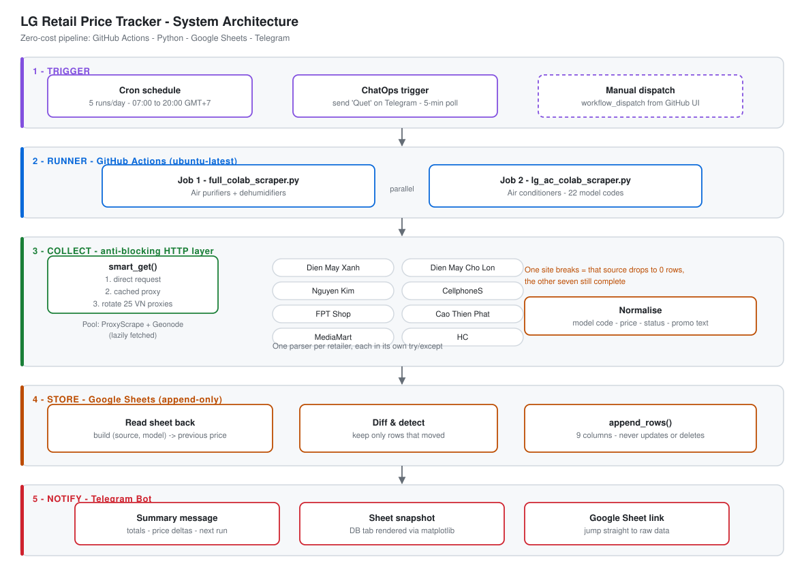
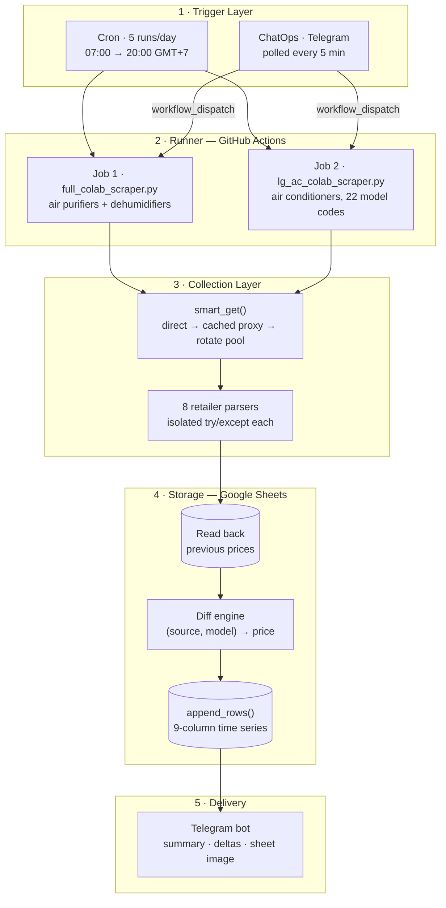
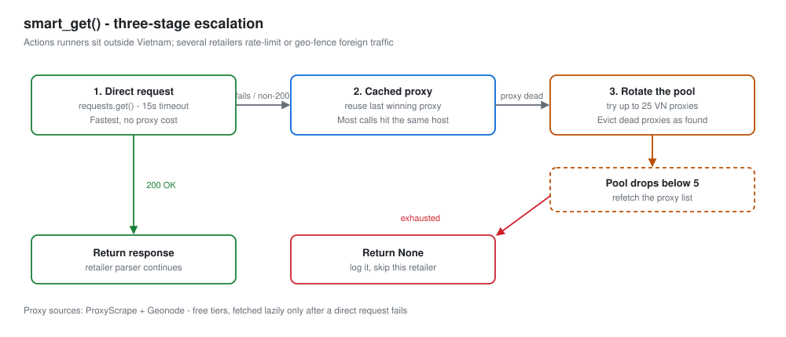
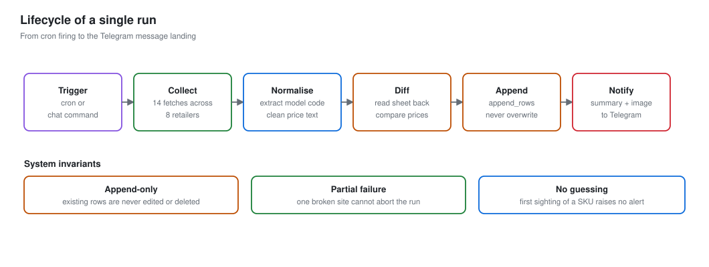
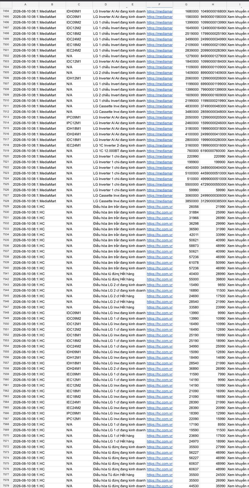
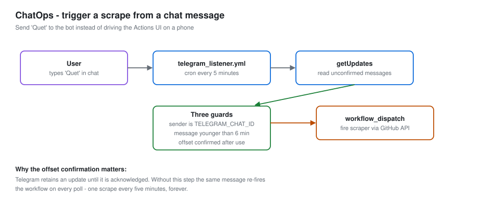
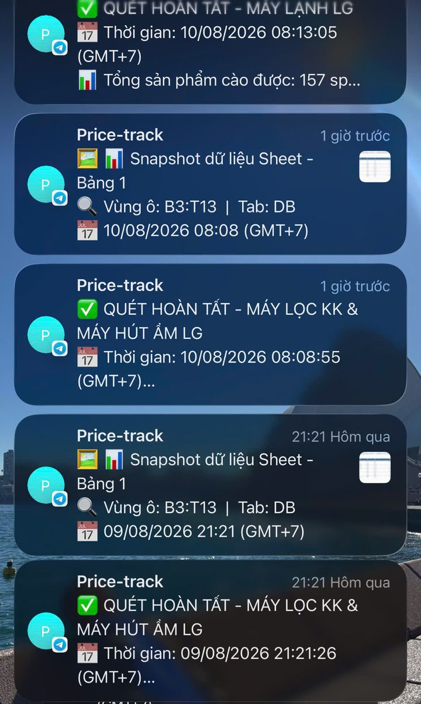

# 🛰️ LG Retail Price Tracker (Vietnam E-Commerce Price Intelligence)

[](https://github.com/ngtndat/dmx_price_tracker/actions/workflows/lg_price_scraper.yml)
[](https://github.com/ngtndat/dmx_price_tracker/actions/workflows/telegram_listener.yml)

> **Zero-cost competitive pricing pipeline.** Scrapes LG appliance prices from **8 major Vietnamese electronics retailers** five times a day, stores every observation in **Google Sheets** as an append-only time series, diffs consecutive runs to surface real price movements, and pushes alerts to **Telegram** — all orchestrated by **GitHub Actions**, with no server and no recurring cost.

> 📦 Companion project: [**AR SpaceVision**](AR%20application/) — a WebAR viewer that places the same products in the user's room at true 1:1 scale.

---

## 📐 System Architecture



> 🎨 *Five layers: trigger → runner → collection → storage → notification. Each layer fails independently.*

### 🔄 Data Flow



### 🧱 Architectural Components

| Layer | Technology | Responsibility |
|---|---|---|
| Scheduling | GitHub Actions cron (UTC) | 5 fixed runs/day, offset to Vietnam time |
| ChatOps | Telegram Bot API + `workflow_dispatch` | On-demand scrape from a chat message |
| Collection | Python · `requests` · `BeautifulSoup4` | 8 retailer-specific parsers |
| Anti-blocking | Rotating VN HTTP proxy pool | Bypass geo-fencing from foreign runners |
| Storage | Google Sheets via `gspread` | Append-only observation log |
| Change detection | In-process diff against last run | Surface only genuine price moves |
| Alerting | Telegram Bot API + `matplotlib` | Text summary + rendered sheet snapshot |

---

## 🎯 The Problem

The same LG air conditioner carries a different price at Điện Máy Xanh, Nguyễn Kim and FPT Shop on any given day, and each chain runs its own promotion calendar. For a brand trying to understand how its products are actually priced across its retail partners, that means:

- **Manual checking does not scale.** 8 retailers × ~40 SKUs × 5 checks a day is 1,600 page loads.
- **Point-in-time snapshots lose the story.** Knowing today's price says nothing about whether a chain has been quietly discounting for two weeks.
- **Price moves are the signal, not price levels.** What matters operationally is *"MediaMart dropped IDC12M2 by 400k overnight"*, not a static table.

This project turns that into an automated loop that runs unattended and reports only what changed.

---

## 🛒 Coverage

| Scraper | Category | Retailers | Sheet tab |
|---|---|---|---|
| [`full_colab_scraper.py`](full_colab_scraper.py) | Air purifiers + dehumidifiers | 8 | `Sheet1` |
| [`lg_ac_colab_scraper.py`](lg_ac_colab_scraper.py) | Air conditioners (22 model codes) | 7 | `raw_RAC` |

**Retailers:** Điện Máy Xanh · Điện Máy Chợ Lớn · Nguyễn Kim · CellphoneS · FPT Shop · Cao Thiên Phát · MediaMart · HC

Most are scraped from their LG category page. **Nguyễn Kim is the exception** — its category listing omits prices for several SKUs, so the air-purifier scraper walks a curated list of 10 product URLs and parses each detail page individually ([`NK_PRODUCT_URLS`](full_colab_scraper.py#L45)), falling back through `__NEXT_DATA__` JSON → JSON-LD → HTML selectors depending on what that page exposes.

---

## 🌐 Anti-Blocking: `smart_get()`



GitHub Actions runners are hosted outside Vietnam, and several of these retailers rate-limit or geo-fence foreign traffic — FPT Shop in particular serves a Cloudflare challenge. [`smart_get()`](full_colab_scraper.py#L186) handles this with a three-stage escalation:

| Stage | Behaviour | Rationale |
|---|---|---|
| ① Direct | Plain `requests.get()`, 15s timeout | Fastest path; most retailers allow it |
| ② Cached proxy | Retry through the last proxy that worked | Most calls in a run hit the same host — re-searching the pool every time wastes 20+ seconds |
| ③ Pool rotation | Try up to 25 Vietnamese HTTP proxies | Last resort; dead proxies are evicted as discovered |

The proxy pool is assembled lazily from two free sources (ProxyScrape and Geonode) and only fetched once a direct request has actually failed — a run where every site responds normally never touches the proxy APIs at all. When the pool falls below 5 live entries it is refetched automatically.

If all three stages fail, `smart_get()` returns `None`, the retailer's parser logs and returns an empty list, and **the run continues**.

---

## 🔁 Lifecycle of a Run



A single execution of the air-purifier scraper makes **14 fetches across 8 retailers** — 8 for air purifiers, 6 for dehumidifiers — then aggregates, diffs and writes once.

Three invariants hold throughout:

- **Append-only.** Existing rows are never edited or deleted. The sheet is an observation log, not a current-state table.
- **Partial failure is normal.** Every parser is wrapped in its own `try/except`. One retailer changing its markup degrades that source to zero rows; it never aborts the run or affects the other seven.
- **No guessing.** A SKU seen for the first time raises no alert — there is no baseline to compare against, and emitting one would flood the channel every time a model is added.

---

## 🗃️ Data Schema

Each run appends one row per product observation:

| # | Column | Description |
|---|---|---|
| A | `Giờ quét` | Scrape timestamp, GMT+7 (written only on CI runs) |
| B | `Page Title` | Retailer key — `DMX`, `NguyenKim`, `FPT`, `MediaMart`, `HC`, … |
| C | `Mã Model` | Model code normalised out of the product name/URL |
| D | `Tên Model` | Raw product title as listed |
| E | `Status` | Availability text (`đang kinh doanh` / `Hết hàng`) |
| F | `direct product link` | Canonical product URL |
| G | `MRP price` | List price before discount |
| H | `Selling price` | Actual selling price |
| I | `Thông tin chương trình khuyến mãi` | Free-text promotion blurb |

<p align="center">
  
</p>

> 📊 *Live sheet after a few months of unattended operation — **7,579 rows** of MediaMart and HC observations, each stamped with its scrape time. This is the raw material a pricing analysis would run on.*

---

## 📈 Change Detection

Before writing, the scraper reads the existing sheet back and builds a lookup of
`(retailer, model code) → last recorded selling price`. Any row whose price differs from its predecessor is collected and highlighted in the Telegram message ([`full_colab_scraper.py:1306`](full_colab_scraper.py#L1306)).

```python
price_old = last_prices.get((row["Page Title"], model_code), None)

if price_old is not None and price_old != price_new:
    price_changes.append({
        "model":  model_code,
        "source": row["Page Title"],
        "old":    price_old,
        "new":    price_new,
    })
```

**Why the composite key.** Keying on the model code alone would be wrong: the same SKU carries different prices at different chains, so a model-only key collapses eight independent price series into one and reports a "change" every time the iteration order shifts. The `(retailer, model)` pair is the actual unit of observation.

**Why `is not None` rather than a truthiness check.** A genuinely missing baseline and a recorded price of `0` are different states, and the second one happens — an out-of-stock listing can render as `0`. Collapsing them would suppress a real alert.

---

## 🤖 ChatOps: Trigger a Scrape by Chat Message



Waiting for the next cron slot is inconvenient when a number is needed *now*, and the GitHub Actions UI is painful on a phone. [`telegram_listener.yml`](.github/workflows/telegram_listener.yml) closes that gap: every 5 minutes it runs [`check_telegram_command.py`](.github/scripts/check_telegram_command.py), which polls `getUpdates` for `quét` / `quet` / `scan` and fires a `workflow_dispatch` at the scraper.

Three guards make it safe to leave running unattended:

| Guard | Implementation | Prevents |
|---|---|---|
| Sender allow-list | Message `chat_id` must equal `TELEGRAM_CHAT_ID` | Anyone who finds the bot triggering runs |
| Freshness window | Commands older than 360s are discarded | A backlog replaying as a burst of scrapes |
| Offset confirmation | `getUpdates` re-called with an advanced offset | The same message re-firing on every poll |

The third one is the subtle one. Telegram retains an update until it is explicitly acknowledged; without confirming the offset, one "Quét" message would trigger a scrape **every five minutes, forever**.

---

## 📲 Alerting

After a successful write the bot sends a run summary — total products collected, price movements grouped by retailer, and the next scheduled run — then renders the report tab to a PNG via `matplotlib` and posts that too, so the numbers are readable on a phone without opening Sheets.

<p align="center">
  
</p>

> 📱 *Real notifications from two consecutive scheduled runs: **157 products** collected for air conditioners, **181** for air purifiers and dehumidifiers, each followed by a sheet snapshot.*

Message format:

```
✅ QUÉT HOÀN TẤT - MÁY LỌC KK & MÁY HÚT ẨM LG
📅 Thời gian: 10/08/2026 08:08:55 (GMT+7)
📊 Tổng sản phẩm cào được: 181 sp
━━━━━━━━━━━━━━━━━━━━━━━━━
📈 Biến động giá bán so với lần quét trước:

- MediaMart:
  * IDC12M2: 12.490 ➔ 12.090
  * IEC09M2: 9.990  ➔ 9.590

📋 Google Sheet: Xem tại đây
━━━━━━━━━━━━━━━━━━━━━━━━━
⏰ Lần quét tiếp theo: 10/08/2026 09:30
```

---

## ⏰ Schedule

GitHub Actions cron runs on UTC only, so the schedule is offset by 7 hours:

| Vietnam (GMT+7) | Cron (UTC) | Rationale |
|---|---|---|
| 07:00 | `0 0 * * *` | Before retail sites publish daily promotions |
| 09:30 | `30 2 * * *` | After morning price updates settle |
| 12:00 | `0 5 * * *` | Midday flash-sale window |
| 16:00 | `0 9 * * *` | Afternoon repricing |
| 20:00 | `0 13 * * *` | Evening peak shopping traffic |

The same times are mirrored in `SCHEDULE_TIMES` inside each script. On CI the scripts detect `GITHUB_ACTIONS=true` and scrape immediately; the in-process scheduler is only used for local/Colab runs, where it also drives the *"next run at …"* line in the Telegram message.

---

## 📁 Directory Structure

```
dmx_price_tracker/
├── full_colab_scraper.py           # Air purifier + dehumidifier scraper (8 retailers)
├── lg_ac_colab_scraper.py          # Air conditioner scraper (7 retailers, 22 models)
├── .env.example                    # Required environment variables
│
├── .github/
│   ├── workflows/
│   │   ├── lg_price_scraper.yml    # 5x daily, two parallel jobs
│   │   ├── telegram_listener.yml   # ChatOps poller, every 5 min
│   │   └── deploy-ar.yml           # Publish AR app to GitHub Pages
│   └── scripts/
│       └── check_telegram_command.py
│
├── docs/                           # Architecture diagrams & screenshots
│
└── AR application/                 # Companion WebAR project (own README)
```

---

## 🚀 Quick Start

### Step 1 · Prerequisites

```bash
pip install requests[socks] beautifulsoup4 gspread urllib3 matplotlib
```

A **Google service account** with edit access to the target spreadsheet, and a **Telegram bot** from [@BotFather](https://t.me/BotFather).

### Step 2 · Configuration

No credentials live in the source tree — everything is read from the environment. Copy [`.env.example`](.env.example) and fill it in:

| Variable | Purpose |
|---|---|
| `GOOGLE_SERVICE_ACCOUNT_JSON` | Service account JSON, full file contents |
| `SPREADSHEET_URL` | Target spreadsheet (both scrapers share one, separate tabs) |
| `SHEET_NAME` | `Sheet1` for purifiers, `raw_RAC` for air conditioners |
| `TELEGRAM_BOT_TOKEN` | Bot token from @BotFather |
| `TELEGRAM_CHAT_ID` | Destination chat — also the ChatOps allow-list |

On GitHub these become repository secrets (*Settings → Secrets and variables → Actions*). `SHEET_NAME` is not sensitive and is set inline per job in the workflow.

If `SPREADSHEET_URL` is missing the script **exits immediately** rather than running and silently discarding its results.

### Step 3 · Run

#### 🟢 Option A — GitHub Actions (production)

Push to `main`; the schedule takes over. To run now: *Actions → LG Price Scraper → Run workflow*, or just message the bot.

#### 🟡 Option B — Local

```bash
cp .env.example .env        # fill in, then export
python full_colab_scraper.py
```

Run interactively, the script offers a choice between scraping immediately and waiting on the built-in scheduler.

#### 🟣 Option C — Google Colab

Both scrapers are deliberately **single-file**: paste one into a Colab cell, set the environment variables in a preceding cell, and run. This was the original deployment target before the pipeline moved to Actions, and it is still how non-engineer colleagues run ad-hoc scrapes.

---

## 💻 Console Output

Each run prints a structured log. Line formats are taken verbatim from the source:

```
======================================================================
🚀 BẮT ĐẦU QUÉT - 10/08/2026 08:05:12 (GMT+7)
======================================================================

==================== QUÉT MÁY LỌC KHÔNG KHÍ LG ====================

--- 1. CÀO DIỆN MÁY XANH (DMX) ---
[1/12] DMX: Máy lọc không khí LG PuriCare AS60GHWG0
...
--- 5. CÀO FPT SHOP (FPT) ---
  [smart_get] Lỗi kết nối trực tiếp đến https://fptshop.com.vn/... Thử qua proxy...
[Proxy] Đang tải danh sách proxy Việt Nam từ nhiều API...
[Proxy] -> Tổng cộng đã thu thập được 87 proxy HTTP Việt Nam.
  [Thành công] Đã tải trang FPT Shop thành công qua proxy 113.160.x.x:8080!

[OK] Thu được 181 sản phẩm từ 8 nguồn.

--- XUẤT DỮ LIỆU LÊN GOOGLE SHEET ---
Đang ghi vào tab 'Sheet1'...
[THÀNH CÔNG] Dữ liệu đã được ghi vào Google Sheet!
[OK] Đã gửi thông báo Telegram thành công!
```

---

## 🧠 Design Notes

**Google Sheets as the warehouse.** A relational database models this data better, and everyone involved knows it. Sheets won because the end users are category managers who already live in spreadsheets: they pivot, chart and share without anyone provisioning access or writing SQL. The append-only pattern keeps raw observations intact, so a real warehouse can be backfilled later without data loss. *This is a deliberate trade of technical fit for adoption.*

**Two scrapers, not one parameterised module.** The two categories share roughly 60% of their parsing logic, and that duplication is real. It was kept because each file must stay runnable as a standalone Colab cell — extracting a shared module breaks the paste-and-run workflow that non-engineer colleagues depend on. *DRY traded for distribution, consciously.*

**Failure is partial, never total.** Per-retailer exception isolation, proxy fallback, and a hard guard against starting without configuration all follow one principle: a run that collects 7 of 8 sources is useful, and a run that reports honestly on what it missed is more useful than one that silently writes nothing.

**Secrets were retrofitted, not designed in.** An earlier revision had the bot token and spreadsheet URL hard-coded. Moving them to environment variables meant rebuilding the repository history, since deleting a secret from the current file leaves it fully readable in every prior commit of a public repo. *The lesson was that credential hygiene is a property of history, not of the working tree.*

---

## 📉 Limitations & Further Work

- **Parser fragility.** Every parser is coupled to the retailer's current HTML. There is no schema-change detection beyond a row count dropping to zero, and no test suite pinned to recorded fixtures. A retailer redesigning overnight fails silently in a single source.
- **Silent degradation on auth failure.** If the service account cannot authenticate, the script falls back to a print-only test mode and still exits `0` — the CI job shows green while writing nothing. On CI this should fail loudly.
- **Public proxy quality.** The free pools are unreliable and unvetted. A paid residential proxy, or a runner hosted inside Vietnam, would remove the dependency entirely.
- **No analytics layer.** The pipeline captures a dense price time series but currently only diffs consecutive runs. Price elasticity estimation, promotion-cycle detection, and cross-retailer positioning analysis are the natural next step — and the reason the raw observations are preserved rather than overwritten.

---

## ⚖️ Scope & Intent

This project reads publicly accessible catalogue pages, read-only, five times a day — a volume far below normal browsing traffic. It collects listed prices and promotion text only: no personal data, no account-gated content, no checkout interaction. It was built to support internal pricing analysis of one brand's own products across its retail partners.

---

<details>
<summary><b>🇻🇳 Bản tiếng Việt — bấm để mở</b></summary>

<br>

## 🎯 Bài toán

Cùng một model máy lạnh LG, giá tại Điện Máy Xanh, Nguyễn Kim và FPT Shop trong cùng một ngày lại khác nhau, và mỗi chuỗi chạy lịch khuyến mãi riêng. Với một thương hiệu muốn hiểu sản phẩm của mình đang được định giá thế nào trên hệ thống đối tác bán lẻ, điều đó có nghĩa là:

- **Kiểm tra thủ công không khả thi.** 8 nhà bán lẻ × ~40 SKU × 5 lần/ngày = 1.600 lượt tải trang.
- **Ảnh chụp một thời điểm làm mất câu chuyện.** Biết giá hôm nay không cho biết một chuỗi đã âm thầm giảm giá suốt hai tuần qua hay chưa.
- **Tín hiệu nằm ở biến động, không phải mức giá.** Cái có giá trị vận hành là *"MediaMart giảm IDC12M2 400k qua đêm"*, chứ không phải một bảng giá tĩnh.

Dự án biến việc đó thành một vòng lặp tự động chạy không cần giám sát, và chỉ báo cáo những gì đã thay đổi.

## 🛒 Phạm vi thu thập

| Scraper | Ngành hàng | Số site | Tab Sheet |
|---|---|---|---|
| [`full_colab_scraper.py`](full_colab_scraper.py) | Máy lọc không khí + máy hút ẩm | 8 | `Sheet1` |
| [`lg_ac_colab_scraper.py`](lg_ac_colab_scraper.py) | Máy lạnh (22 mã model) | 7 | `raw_RAC` |

**Các site:** Điện Máy Xanh · Điện Máy Chợ Lớn · Nguyễn Kim · CellphoneS · FPT Shop · Cao Thiên Phát · MediaMart · HC

Đa số được cào từ trang danh mục LG. **Riêng Nguyễn Kim là ngoại lệ** — trang danh mục không hiện giá cho một số SKU, nên scraper duyệt qua danh sách 10 URL sản phẩm và bóc từng trang chi tiết ([`NK_PRODUCT_URLS`](full_colab_scraper.py#L45)), thử lần lượt `__NEXT_DATA__` JSON → JSON-LD → selector HTML tuỳ theo trang đó để lộ cái nào.

## 🌐 Chống chặn: `smart_get()`

Runner của GitHub Actions đặt ngoài Việt Nam, trong khi nhiều site giới hạn hoặc chặn traffic nước ngoài — riêng FPT Shop trả về thử thách Cloudflare. [`smart_get()`](full_colab_scraper.py#L186) xử lý theo 3 bậc:

| Bậc | Cách làm | Lý do |
|---|---|---|
| ① Trực tiếp | `requests.get()` thuần, timeout 15s | Nhanh nhất, đa số site cho phép |
| ② Proxy đã cache | Thử lại bằng proxy vừa thành công gần nhất | Phần lớn request trong một lượt trỏ cùng host — dò lại pool mỗi lần tốn hơn 20 giây |
| ③ Xoay vòng pool | Thử tối đa 25 proxy HTTP Việt Nam | Phương án cuối; proxy chết bị loại ngay khi phát hiện |

Pool proxy được dựng lười từ hai nguồn miễn phí (ProxyScrape, Geonode) và **chỉ tải khi đã có một request trực tiếp thất bại** — lượt quét nào mà mọi site đều phản hồi bình thường thì không hề gọi tới API proxy. Khi pool còn dưới 5 proxy sống, hệ thống tự tải lại.

Nếu cả 3 bậc đều hỏng, `smart_get()` trả về `None`, parser của site đó ghi log rồi trả về danh sách rỗng, và **lượt quét vẫn tiếp tục**.

## 🔁 Vòng đời một lượt quét

Một lần chạy scraper máy lọc không khí thực hiện **14 lượt gọi qua 8 nhà bán lẻ** — 8 cho máy lọc, 6 cho máy hút ẩm — rồi mới tổng hợp, đối chiếu và ghi một lần duy nhất.

Ba bất biến được giữ xuyên suốt:

- **Chỉ ghi thêm.** Dòng cũ không bao giờ bị sửa hay xoá. Sheet là nhật ký quan sát, không phải bảng trạng thái hiện tại.
- **Hỏng một phần là chuyện bình thường.** Mỗi parser có `try/except` riêng. Một site đổi giao diện thì nguồn đó về 0 dòng, không làm sập lượt quét và không ảnh hưởng 7 nguồn còn lại.
- **Không đoán mò.** SKU xuất hiện lần đầu thì không cảnh báo — chưa có mốc để so, và nếu báo thì mỗi lần thêm model mới sẽ làm ngập kênh thông báo.

## 📈 Phát hiện biến động giá

Trước khi ghi, scraper đọc ngược Sheet để dựng map `(nhà bán lẻ, mã model) → giá bán ghi nhận lần trước`. Dòng nào lệch giá so với lần trước sẽ được thu lại và làm nổi bật trong tin nhắn Telegram.

**Vì sao khoá là một cặp.** Nếu chỉ khoá theo mã model thì sai: cùng một SKU nhưng mỗi chuỗi bán một giá, nên khoá theo model sẽ gộp 8 chuỗi giá độc lập thành một, và cứ mỗi lần thứ tự duyệt thay đổi là lại báo "đổi giá" nhầm. Cặp `(nhà bán lẻ, model)` mới đúng là đơn vị quan sát.

**Vì sao dùng `is not None` thay vì kiểm tra truthy.** "Chưa có mốc so sánh" và "giá ghi nhận bằng 0" là hai trạng thái khác nhau, và trạng thái thứ hai có xảy ra thật — sản phẩm hết hàng đôi khi hiện giá 0. Gộp hai trạng thái này lại sẽ làm mất một cảnh báo thật.

## 🤖 ChatOps: kích hoạt bằng tin nhắn

Chờ tới khung giờ cron tiếp theo thì bất tiện khi cần số liệu ngay, mà thao tác giao diện GitHub Actions trên điện thoại lại rất khó chịu. [`telegram_listener.yml`](.github/workflows/telegram_listener.yml) giải quyết việc đó: cứ 5 phút chạy [`check_telegram_command.py`](.github/scripts/check_telegram_command.py), tìm tin nhắn `quét` / `quet` / `scan` rồi bắn `workflow_dispatch` kích hoạt scraper.

| Lớp bảo vệ | Cách làm | Ngăn được |
|---|---|---|
| Lọc người gửi | `chat_id` phải khớp `TELEGRAM_CHAT_ID` | Người lạ tìm ra bot và kích hoạt bừa |
| Cửa sổ 6 phút | Bỏ qua lệnh cũ hơn 360 giây | Tin tồn đọng chạy dồn thành một loạt |
| Xác nhận offset | Gọi lại `getUpdates` với offset mới | Cùng một tin kích hoạt lại ở mỗi lần poll |

Lớp thứ ba là chỗ tinh tế. Telegram giữ lại update cho tới khi được báo đã đọc; thiếu bước xác nhận offset, một tin "Quét" sẽ kích hoạt lượt quét **mỗi 5 phút, vô hạn**.

## ⏰ Lịch chạy

Cron của GitHub Actions chỉ chạy theo UTC nên lịch được lùi 7 tiếng:

| Giờ VN (GMT+7) | Cron (UTC) | Lý do chọn mốc |
|---|---|---|
| 07:00 | `0 0 * * *` | Trước khi các site công bố khuyến mãi trong ngày |
| 09:30 | `30 2 * * *` | Sau khi giá buổi sáng đã ổn định |
| 12:00 | `0 5 * * *` | Khung flash sale giữa trưa |
| 16:00 | `0 9 * * *` | Đợt điều chỉnh giá buổi chiều |
| 20:00 | `0 13 * * *` | Giờ cao điểm mua sắm buổi tối |

Các mốc này cũng được giữ trong `SCHEDULE_TIMES` ở mỗi script. Khi chạy trên CI, script nhận ra `GITHUB_ACTIONS=true` và quét ngay; bộ hẹn giờ nội bộ chỉ dùng khi chạy local hoặc Colab, đồng thời để tính dòng *"lần quét tiếp theo"* trong tin nhắn Telegram.

## 🚀 Chạy dự án

```bash
pip install requests[socks] beautifulsoup4 gspread urllib3 matplotlib
cp .env.example .env        # điền giá trị rồi export
python full_colab_scraper.py
```

Không có thông tin nhạy cảm nào nằm trong mã nguồn; mọi cấu hình đọc từ biến môi trường: `GOOGLE_SERVICE_ACCOUNT_JSON`, `SPREADSHEET_URL`, `SHEET_NAME`, `TELEGRAM_BOT_TOKEN`, `TELEGRAM_CHAT_ID`. Trên GitHub, đây là repository secrets. Riêng `SHEET_NAME` không nhạy cảm nên đặt thẳng trong workflow cho từng job.

Thiếu `SPREADSHEET_URL` thì script **dừng ngay** thay vì chạy rồi âm thầm vứt bỏ kết quả.

Hai scraper được giữ ở dạng **một file duy nhất** để dán thẳng vào một cell Google Colab — đó là môi trường triển khai ban đầu, và tới giờ vẫn là cách các đồng nghiệp không phải dân kỹ thuật chạy quét đột xuất.

## 🧠 Ghi chú thiết kế

**Vì sao dùng Google Sheets làm kho dữ liệu.** Một cơ sở dữ liệu quan hệ mô hình hoá dữ liệu này tốt hơn, và ai cũng biết điều đó. Sheets được chọn vì người dùng cuối là các bạn quản lý ngành hàng vốn đã làm việc hằng ngày trên bảng tính: họ tự pivot, tự vẽ biểu đồ, tự chia sẻ mà không cần ai cấp quyền hay viết SQL. Cách ghi chỉ-thêm giữ nguyên dữ liệu quan sát thô, nên sau này hoàn toàn có thể backfill sang warehouse thật mà không mất mát. *Đây là đánh đổi có chủ đích: hy sinh độ phù hợp kỹ thuật để lấy khả năng được sử dụng thật.*

**Vì sao hai scraper riêng thay vì một module tham số hoá.** Hai ngành hàng trùng nhau khoảng 60% logic bóc tách, và phần lặp đó là có thật. Vẫn giữ như vậy vì mỗi file phải chạy độc lập được khi dán vào Colab — tách module dùng chung sẽ phá vỡ quy trình "dán-và-chạy" mà đồng nghiệp không phải dân kỹ thuật đang dựa vào. *Đánh đổi DRY để lấy khả năng phân phối, một cách có ý thức.*

**Hỏng thì hỏng một phần, không hỏng toàn bộ.** Cô lập exception theo từng site, dự phòng proxy, và chặn khởi chạy khi thiếu cấu hình đều theo cùng một nguyên tắc: một lượt quét lấy được 7/8 nguồn vẫn có giá trị, và một lượt báo cáo trung thực phần nó bỏ lỡ thì còn giá trị hơn một lượt âm thầm không ghi gì.

**Quản lý secret là thứ được vá vào sau, không phải thiết kế từ đầu.** Một bản trước đây hardcode token bot và URL spreadsheet ngay trong file. Việc chuyển sang biến môi trường buộc phải dựng lại toàn bộ lịch sử repo, vì xoá secret khỏi file hiện tại vẫn để nguyên nó ở mọi commit trước đó của một repo public. *Bài học rút ra: vệ sinh thông tin nhạy cảm là thuộc tính của lịch sử, không phải của cây làm việc.*

## 📉 Hạn chế & hướng phát triển

- **Parser dễ vỡ.** Mỗi parser bám chặt vào cấu trúc HTML hiện tại của site. Chưa có cơ chế phát hiện đổi cấu trúc ngoài việc số dòng tụt về 0, cũng chưa có bộ test chạy trên dữ liệu mẫu đã lưu. Một site thiết kế lại qua đêm sẽ hỏng âm thầm ở đúng nguồn đó.
- **Hỏng xác thực nhưng vẫn báo xanh.** Nếu service account không xác thực được, script rơi vào chế độ test chỉ in màn hình và vẫn thoát mã `0` — job CI hiện xanh dù không ghi được gì. Trên CI, đúng ra phải fail hẳn.
- **Chất lượng proxy công cộng.** Các pool miễn phí không ổn định và không được kiểm chứng. Proxy residential trả phí, hoặc runner đặt trong nước, sẽ gỡ bỏ hẳn phụ thuộc này.
- **Chưa có tầng phân tích.** Pipeline thu được chuỗi thời gian giá khá dày nhưng hiện mới chỉ so sánh hai lượt liền kề. Ước lượng độ co giãn giá, nhận diện chu kỳ khuyến mãi và phân tích định vị giá giữa các nhà bán lẻ là bước tiếp theo tự nhiên — và cũng là lý do dữ liệu quan sát thô được giữ lại thay vì ghi đè.

## ⚖️ Phạm vi sử dụng

Dự án chỉ đọc các trang danh mục công khai, chỉ đọc, 5 lần mỗi ngày — tần suất thấp hơn nhiều so với lưu lượng duyệt web thông thường. Dữ liệu thu thập giới hạn ở giá niêm yết và nội dung khuyến mãi: không có dữ liệu cá nhân, không truy cập nội dung cần đăng nhập, không can thiệp quy trình đặt hàng. Mục đích là phục vụ phân tích giá nội bộ cho chính sản phẩm của một thương hiệu trên hệ thống các đối tác bán lẻ.

</details>

---

## 🤝 Related

| Project | Description |
|---|---|
| [**AR SpaceVision**](AR%20application/) | WebAR viewer for the same LG catalogue — 1:1 scale, no app install |
