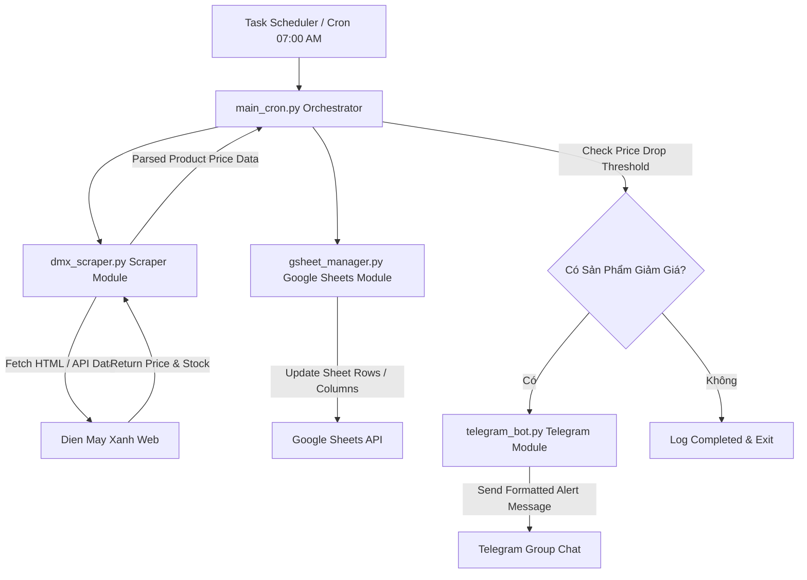

# Technical Architecture & System Design: dmx-price-automation

## Architecture Overview



## Component Details

### 1. Scraper Module (`dmx_scraper.py`)
- **Nhiệm vụ**: Đọc danh sách sản phẩm từ `products.json` hoặc tab `Config` trên Google Sheets, truy cập URL Điện Máy Xanh, bóc tách:
  - Tên sản phẩm chính thức.
  - Giá bán khuyến mãi hiện tại (Current Price).
  - Giá niêm yết/giá gốc (Original Price).
  - Trạng thái hàng (Còn hàng / Hết hàng).
- **Công nghệ**: `Playwright` hoặc `requests` + `BeautifulSoup4` kèm User-Agent rotator.

### 2. Google Sheets Module (`gsheet_manager.py`)
- **Nhiệm vụ**: Kết nối tới Google Sheets qua `gspread` và `google-oauth`.
- **Cấu trúc Tab Sheets**:
  - `Dashboard`: Tóm tắt giá mới nhất hôm nay vs hôm qua, chênh lệch (%).
  - `Price_History`: Mỗi dòng là 1 ngày, các cột là giá của từng sản phẩm.
  - `Product_List`: Danh sách URL & Tên sản phẩm cần theo dõi.

### 3. Telegram Notifier Module (`telegram_bot.py`)
- **Nhiệm vụ**: Định dạng tin nhắn HTML/Markdown chứa thông tin giảm giá và gửi qua Telegram Bot API (`https://api.telegram.org/bot<TOKEN>/sendMessage`).
- **Mẫu tin nhắn Telegram**:
  ```html
  🚨 <b>CẢNH BÁO GIẢM GIÁ ĐIỆN MÁY XANH</b> 🚨
  📅 <i>Ngày: 23/07/2026 07:15 AM</i>
  -----------------------------------
  🔹 <b>Tủ lạnh Panasonic Inverter 322 lít</b>
  🔻 Giá cũ: 12,990,000đ ➔ Giá mới: 11,490,000đ (-11.5%)
  🔗 <a href="...">Xem chi tiết sản phẩm</a>
  ```

### 4. Orchestrator (`main.py` / `main_cron.py`)
- Đọc config, điều phối luồng: Run Scraper ➔ Update Sheets ➔ Compare Prices ➔ Trigger Telegram Alert ➔ Log execution status.
