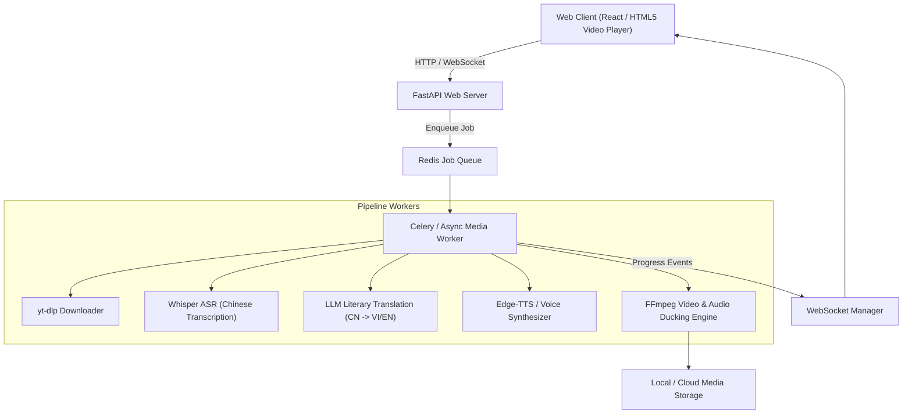

# System Design & Architecture: YouTube Chinese Story Dubbing Platform (`youtube-chinese-story-dubbing`)

## Architecture Overview



### Component Breakdown
1. **Frontend Layer**: Modern responsive Web App (React / Vanilla JS + Tailwind/CSS System) with YouTube URL input, real-time WebSocket progress tracker, multi-language/dubbing toggles, audio-video player, and MP4/SRT download manager.
2. **API Gateway & WebSocket Server (FastAPI)**: Validates input, manages job lifecycle, streams progress updates to the client via WebSockets.
3. **Queue Manager (Redis + Celery)**: Manages async task execution, concurrency control, and retries.
4. **Media & AI Pipeline**:
   - **Downloader Module**: Uses `yt-dlp` to fetch audio/video.
   - **ASR Module**: Uses Whisper to segment Chinese audio into timestamps.
   - **Translation Module**: Prompts LLM (Gemini/OpenAI) for storytelling translation tailored for Vietnamese/English audiobooks.
   - **Dubbing Engine**: Synthesizes audio using Edge-TTS (`vi-VN-HoaiMyNeural`, `vi-VN-NamMinhNeural`, `en-US-AnaNeural`) with word timing alignment.
   - **FFmpeg Compositor**: Dual-mode rendering engine (Original exact assembly OR Anti-Copyright mode: speed 1.03x, hflip, color curve, 4% crop, background music ducking).

## Data Models

```json
{
  "job_id": "job_984712",
  "youtube_url": "https://www.youtube.com/watch?v=example",
  "target_language": "vi",
  "dubbing_mode": "full_dubbing",
  "anti_copyright_toggle": true,
  "status": "processing",
  "progress_percentage": 65,
  "current_stage": "synthesizing_tts",
  "created_at": "2026-07-23T16:00:00Z",
  "artifacts": {
    "original_video_path": "/storage/raw/job_984712.mp4",
    "chinese_srt_path": "/storage/subtitles/job_984712_cn.srt",
    "translated_srt_path": "/storage/subtitles/job_984712_vi.srt",
    "dubbed_audio_path": "/storage/audio/job_984712_dub.mp3",
    "final_output_mp4": "/storage/export/job_984712_final.mp4"
  }
}
```

## API Design
- `POST /api/v1/dub/create`: Create a new dubbing job.
- `GET /api/v1/dub/status/{job_id}`: Poll job status.
- `WS /ws/dub/progress/{job_id}`: Stream real-time progress events.
- `GET /api/v1/dub/download/{job_id}/{file_type}`: Download MP4 or SRT files.

## Non-Functional Requirements
- **Processing Speed**: 20-30 min video processed within 180s.
- **Reliability**: Automatic retries for transient YouTube download errors.
- **Production Deployment**: Docker-compose setup with Nginx reverse proxy, Certbot SSL, and domain binding.

